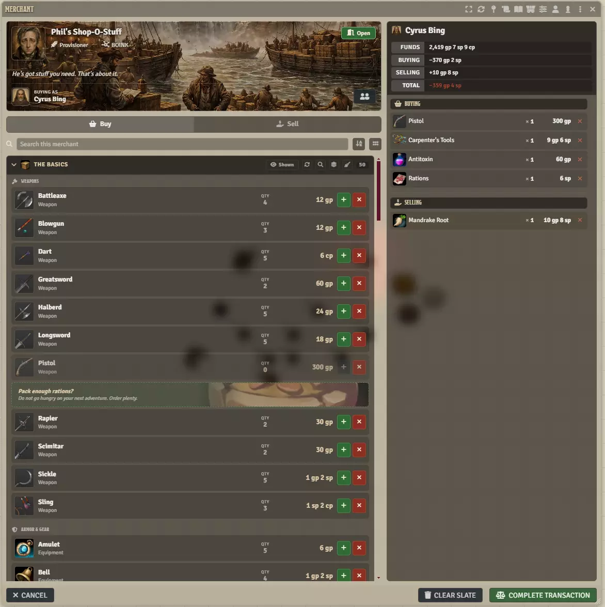
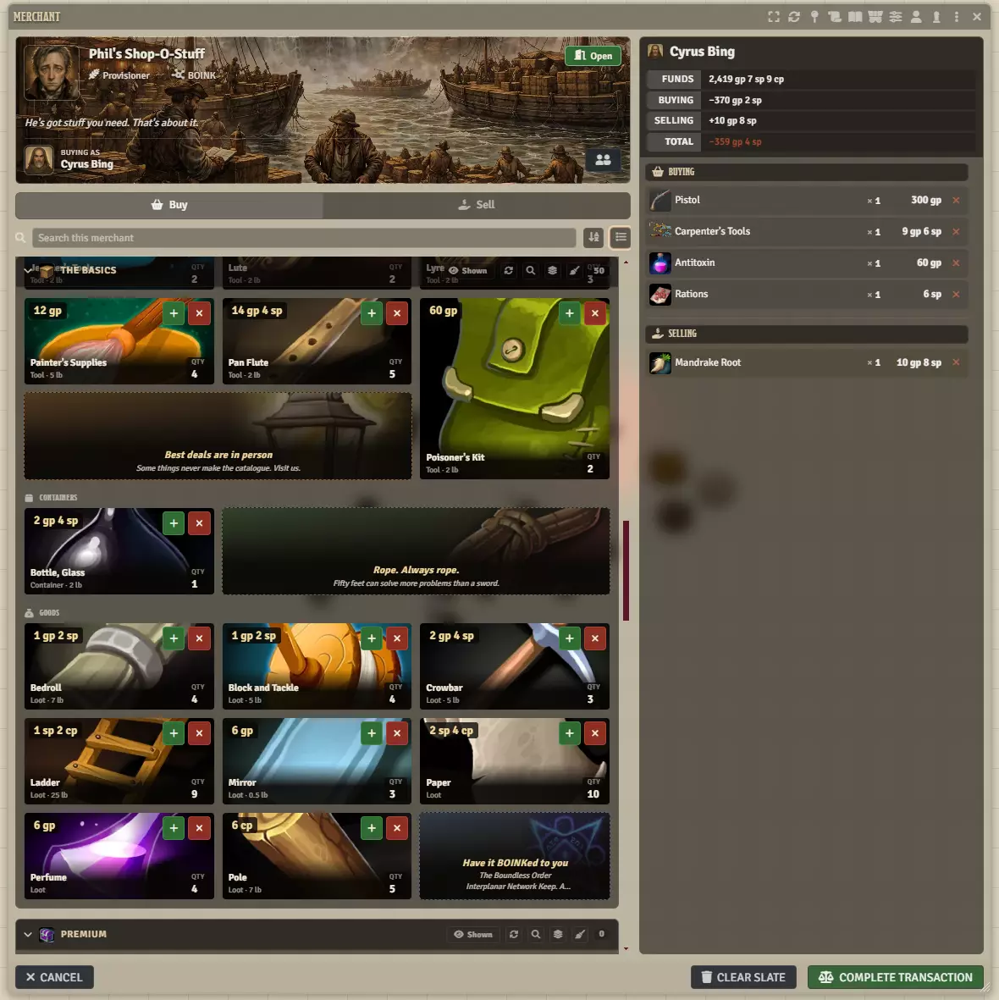
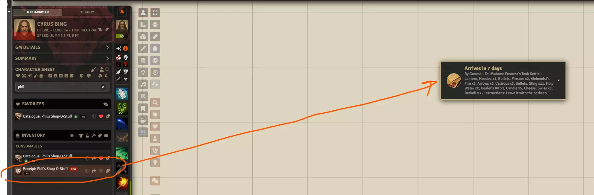
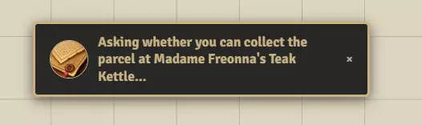
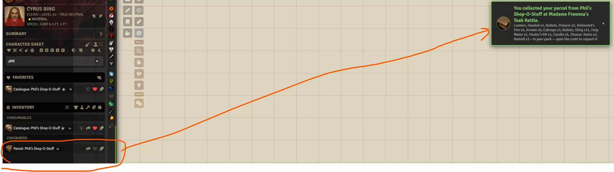
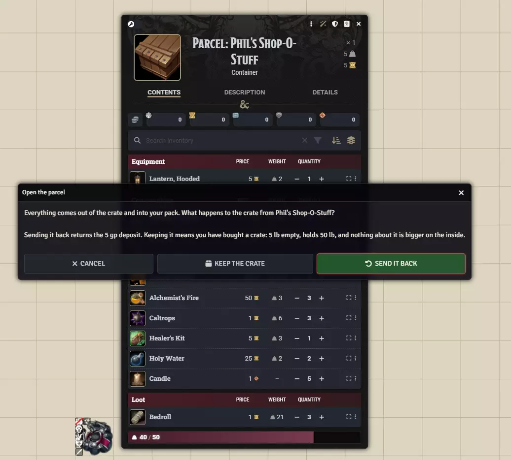

# Getting Started

**Audience:** a GM setting up their first shop, and a player about to walk into one.

What Merchant does, what it needs installed, how to turn an Actor into a shop, and what changes on
screen the moment you do. Fifteen minutes, and you have a shop your players can use.

## What you need before you start

Merchant requires **Coffee Pub Blacksmith**, the suite's hub, and does not run without it. It is built
for **Foundry v13** and the **D&D 5e** system: prices, quantities and coins are read from the system's
own fields, so a shop works with items you already have.

Enable both modules in your world's module settings. Nothing changes on screen until you mark an Actor
as a merchant -- Merchant adds no bar, no tray and no button anywhere until there is a shop to open.

## Turn an Actor into a shop

GM only.

1. Open any Actor's sheet -- an NPC shopkeeper, or an Actor that exists only to be a stall.
2. Click **Merchant Settings** in the sheet's header.
3. Turn on **Is a merchant**.

A shelf called **Storefront** is created for you, and the rest of the settings window becomes useful:
give the shop a name and a **Category** (Provisioner, Blacksmith, Apothecary and so on -- the category
picks the icon a player sees), and optionally a description and an illustration.

Close the settings window. Put a token for that Actor on a scene.

## Set it up in one press

GM only, and optional -- but it is the short way to a working shop.

Under **Shop profiles**, pick one and press **Apply**. **General Goods Merchant** sets the shop's
category, trading hours, markup and till, and adds four shelves: everyday supplies and trade goods drawn
from the SRD compendiums, a buy-back shelf, and a catalogue for ordering by post. Press **Restock
Everything** afterwards and the shelves fill.

**Applying never removes anything.** Shelves already on the merchant are left exactly as they are, stock
included; only shelves the profile names and the merchant does not have are added. The shop's name,
portrait and description are never touched, so a profile can be applied to an NPC your players already
know without turning them into somebody else. Once applied, the section says which profile the shop was
set up from.

**Save a shop you like as a profile.** Press **Save as profile**, give it a name, and every other merchant
can be set up the same way. It saves how the shop *works* -- its category, hours, markup, till, and each
shelf with its compendiums, filters and restock cadence. It does not save the stock, the portrait or the
name, because those belong to that shopkeeper rather than to the kind of shop they run.

## Put something on the shelves

Stock lives in container Items on the merchant, which is why a shopkeeper's own armour and belt dagger
are never for sale -- only what is on a shelf is.

Three ways to fill one, and they mix freely:

- **Drag items onto the shelf.** From a compendium, the Items directory, or another sheet. The shelf is
  a drop target in both the settings window and the shop window.
- **Search the compendiums.** The magnifying glass on a shelf's heading opens a search; what you pick
  lands on that shelf.
- **Roll tables.** Drop a table on a shelf and press **Restock Everything**. A shelf can carry several
  tables, each with its own roll count.

Each shelf decides how its stock behaves: unlimited, finite and running out, or refilling on a cadence
measured in in-world days.

## Open the shop

**Double-click the merchant's token.** That is the whole gesture, and it is the same one for a GM and a
player.

Across the top is the shop's card: its name, its category, its description, and whether it is **Open**
-- a green badge when it is trading, red when it is not. Trading hours appear there too once you have
set any. Below the card are the shelves, grouped by the kind of thing they hold. Each row is one item,
with what it costs and how many are left.

A GM sees more than a player does: hidden shelves, the count on every row (double-click to change it),
and the price (double-click that too).

## Buy something

Any player who owns a character can do this.

1. **Buying as** on the shop's card names who is shopping. A player with one character will not need
   to touch it; a GM, or anyone with several, picks there. The party Group Actor is in the list, so
   shopping for the party means being the party.
2. Press the green **+** on a row. It goes onto the **slate** on the right.
3. Change how many by double-clicking the quantity on the slate line. Zero takes it off.
4. Press **Complete Transaction**.

The slate shows **Funds** -- what the shopper is carrying -- then **Buying**, **Selling** and **Total**,
so the figure is always a change to a purse you can see. Goods and coin move together: either the whole
transaction happens or none of it does.

**Clear Slate** empties it without buying anything.

## Sell something

Only if the shop buys, which means it has a Buyback shelf. If it does not, the **Sell** tab says so.

Switch to **Sell**. Your character's pack is listed; the **+** on a row puts it on the slate to sell,
and the same **Complete Transaction** settles both directions at once. You can buy and sell in the same
press.

## Read the shelves as a wall

The two buttons at the right of the search box change how the shelves are drawn. The list is for
finding a named thing among sixty; the wall is for seeing what a shop has, which is a different
question. Nothing is filtered either way -- the same shelves, the same headings, the same counts.

The shop's own advertising appears among the goods in both views. It is the shop talking, not something
you can buy.

Your choice of view is remembered on your own machine, so the next shop you open opens the way you left
the last one.

## What a closed shop does

A shop outside its trading hours can still be browsed -- you can look through the window -- but nothing
changes hands. The badge reads **Closed** in red, and the settle button says why it is disabled rather
than disappearing. A GM can overrule the schedule, and that exception lapses at the next opening or
closing rather than sticking for ever.

## Three other ways into a shop

Set up once, and your players never need to find the token again.

- **A pin on the map.** In the shop window's header menu, **Pin This Merchant**, then click where it
  goes. The pin opens the same shop the token does -- which is what a market stall actually is, since a
  pinned shop needs no token at all.
- **A region.** Draw a Foundry region, add Merchant's region behaviour, and name the merchant: walking a
  token in opens the shop.
- **A catalogue.** **Print a Catalogue** in the header menu creates an Item named `Catalogue: <shop>`.
  Give it to a party and consulting it opens that shop from wherever they are reading -- no token, no
  map. Goods bought from a catalogue are never handed over on the spot; they are posted.

## Ordering by post

A catalogue shelf is a warehouse rather than a counter, so everything on one arrives by delivery.

The slate gains a **Delivery** section: pick a service (Ground, Courier Beast or Parcel Portal -- they
differ in what they cost and how long they take), then **Deliver to** for a destination, and there is a
box for special instructions to the courier. Crates are charged as a deposit and refunded if you send
them back.

**Place Order** takes the coin now, and a receipt appears in the buyer's inventory. Consulting it says
how long is left, what is coming, by which service and to where.

When the parcel reaches its destination the owner is told. Consult the receipt again to collect it: the
GM is asked whether the party are actually standing at that place, because nothing else in Foundry
knows where you are.

If they say yes, the crate lands in the pack. A Courier Beast is the exception to all of this -- it
finds whoever is carrying the receipt, wherever they are, and needs no destination at all.

Clicking the crate asks what to do with it. **Send it back** returns the deposit; **Keep the crate**
means you have bought a crate, which is a real object with a weight and a capacity. **Cancel** leaves
it shut, and clicking it again asks the same question.

GMs: **Orders in Transit** in the shop window's header menu lists everything in the post across the
whole world, with the ability to hand a parcel over early or strike an order off.

## Where to go next

[Known issues](../known-issues.md) lists what does not work yet.
[Architecture](../architecture/architecture-merchant.md) is for changing Merchant rather than using it.

The screenshots above are from a running world, and every label in this guide was read back against
them. If one does not match what you see on screen, that is a bug worth reporting.
